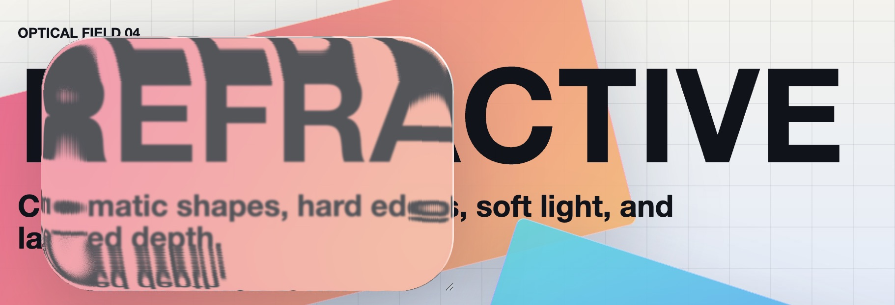

# refractive

[](https://github.com/salnika/refractive/actions/workflows/pr-checks.yml)
[](https://github.com/salnika/refractive/actions/workflows/storybook-pages.yml)
[](https://github.com/salnika/refractive/actions/workflows/npm-publish.yml)
[](https://www.npmjs.com/package/refractive)
[](https://salnika.github.io/refractive/)

Based on the [@hashintel/refractive](https://github.com/hashintel/hash/tree/main/libs/%40hashintel/refractive) lib

## Links

- [Storybook](https://salnika.github.io/refractive/)
- [npm package](https://www.npmjs.com/package/refractive)
- [GitHub Actions](https://github.com/salnika/refractive/actions)

## Install

```sh
vp add refractive
npm install refractive
yarn add refractive
```

## Usage

`refractive` is a higher-order component (HOC) that can wrap any React component to apply refractive glass effects.
The `refraction` prop allows you to customize the appearance of the effect.

The HOC uses SVG filters to create the refractive effect, which is applied via the `backdrop-filter` CSS property.

> Caution: `refractive` will override `style.backdropFilter` and `style.borderRadius` of the wrapped component.

### Example

```tsx
import { refractive } from "refractive";

<refractive.div
  className="your-class-name"
  refraction={{
    radius: 12,
    blur: 4,
    bezelWidth: 10,
  }}
>
  Refractive Glass
</refractive.div>;
```

### Custom component

```tsx
import { refractive } from "refractive";

const RefractiveButton = refractive(Button);

<RefractiveButton
  onClick={() => {}} // your button props
  refraction={{
    radius: 8,
    blur: 2,
    bezelWidth: 8,
  }}
>
  Click Me
</RefractiveButton>;
```

## Options

All numeric options are normalized at runtime to keep filter generation bounded.

| Option            | Default                                               | Range                                                               |
| ----------------- | ----------------------------------------------------- | ------------------------------------------------------------------- |
| `radius`          | required                                              | `0..120`                                                            |
| `blur`            | `0`                                                   | `0..20`                                                             |
| `glassThickness`  | `70`                                                  | `0..300`                                                            |
| `bezelWidth`      | `0`                                                   | `0..120`                                                            |
| `refractiveIndex` | `1.5`                                                 | `1..3`                                                              |
| `specularOpacity` | `0`                                                   | `0..1`                                                              |
| `specularAngle`   | `Math.PI / 4`                                         | finite radians, normalized to `0..2 * Math.PI`                      |
| `pixelRatio`      | `min(devicePixelRatio, 3)` in browsers, `1` otherwise | `1..3`                                                              |
| `bezelHeightFn`   | `convex`                                              | finite values are clamped to `0..1`; failures fall back to `convex` |

## Notes

- The wrapped component must accept a `ref` that points to the underlying DOM element.
- Server rendering is supported: browser-only SVG filter assets are created only after the element is measured in the browser.
- The effect uses SVG filters, canvas-generated data URLs, and CSS `backdrop-filter`; check target browser support before relying on it in production.
- Each distinct refraction shape generates cached filter assets. Keep `radius`, `bezelWidth`, and `pixelRatio` modest when rendering many instances.

# Development

## Setup

This project use <a href="https://viteplus.dev/" style="" target="_blank"></img></a>

```sh
vp install
```

## Start storybook

```sh
vp run dev
```

## Release

The npm publish workflow runs when a `release/x.y.z` tag is pushed. It requires an `NPM_TOKEN` repository secret with publish access to the `refractive` package.

For tag-based releases, the tag version must match `package.json`:

```sh
git tag release/0.0.5
git push origin release/0.0.5
```

Publication is gated by the `npm` GitHub environment. Configure that environment with required reviewers in the repository settings to require manual approval before `npm publish` runs.

[^1]: This project is not affiliated with viteplus
